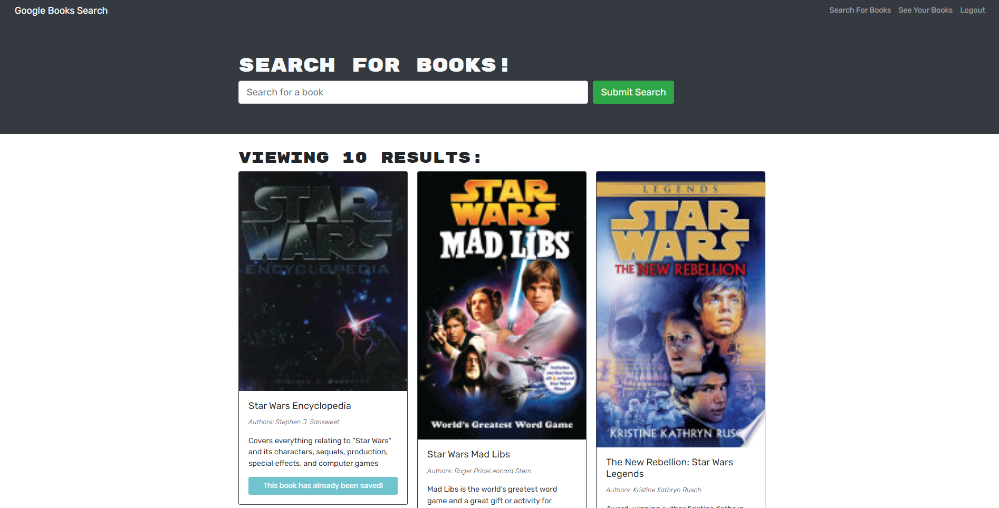

# Book Library

## Description

This application is a Google Books API search engine that was refactored to be a GraphQL API built with Apollo Server. The app was built using the MERN stack with a React front end, MongoDB database, and Node.js/Express.js server and API. 

## Visuals

## Deployed Link

https://pacific-journey-70888.herokuapp.com/
